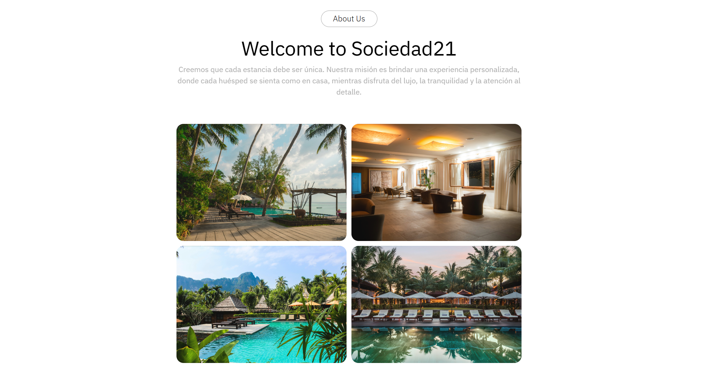

# Sociedad21 (React)

Diseño de landing page para una plataforma de hospedaje. Proyecto enfocado únicamente en **UI/UX (frontend estático)**.

---

## 🎨 Objetivo del proyecto

Este proyecto fue creado para practicar:

- Diseño de interfaces modernas  
- Maquetación responsive  
- Organización de secciones UI  
- Uso de componentes visuales  

---

## 🛠️ Tecnologías

- React  
- JavaScript
- CSS  
- Vite  

---
